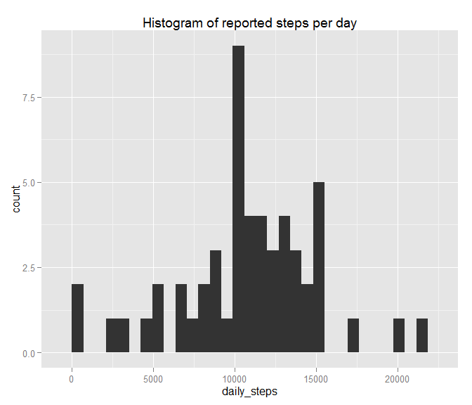
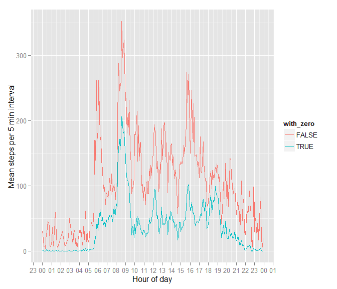
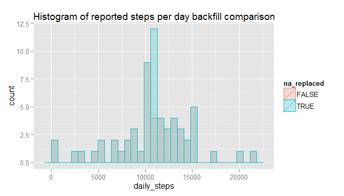
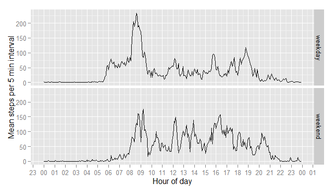

# Reproducible Research: Peer Assessment 1


## Loading and preprocessing the data

**1** Data is available in this github repository as `activity.zip`.
This code assumes the reposotiory base directoyr is the working directory.
The first step of the analysis is to extract the data into a safe location. The
only file in the archive is `activity.csv`. This data file is extracted into
the environment's temporary directory, which is cleaned up on successful script
completion.


```r
# Load up library dependencies in its own chunk to keep the code easier to
# separate

# Plotting
library(ggplot2)

# Data manipulation
library(plyr)

# date_format
library(scales)
```


```r
# Temporary file explicitly removed upon successful completion of script
tmpdir <- tempdir()
activity_file_name <- "activity.csv"
activity_file <- unzip("activity.zip", files = c(activity_file_name), exdir = tmpdir)
if (!length(activity_file)) {
    stop("Unable to extract file")
}
print("Unzipped activity file to")
```

```
## [1] "Unzipped activity file to"
```

```r
print(activity_file)
```

```
## [1] "C:/Users/CHARLE~1/AppData/Local/Temp/2/RtmpcjNkBA/activity.csv"
```

**2** The file contains a header line of `"steps","date","interval"` followed by 
17,568 observations and terminated with a newline. Unfortunately, timezone data
is not presented in the dataset. For the purpose of this analysis, all data will
be assumed to be measured in "local" timezone, and is hard-set to UTC to ensure
reproducatbility of results across various machines.

There are three blocks of data made avaialble for later analysis:

1. `activity` - The raw activity data
2. `activity_noNA` - The raw actvity data with step values of `NA` removed
3. `activity_no0` - The raw activity data with step values of `NA` or 0 removed


```r
# Defaults for read.csv are valid
activity <- read.csv(activity_file)

# Convert dates and times to ACTUAL R date type
activity$hour <- floor(activity$interval / 100)
activity$minute <- activity$interval %% 100
activity$ISO_date <- paste0(activity$date, "T", activity$hour, ":", activity$minute)
activity$date_posix <- as.POSIXct(activity$ISO_date, tz = "UTC", format ="%Y-%m-%dT%H:%M")
activity$time_of_day_str <- format(activity$date_posix, "%H:%M")

# Separate weekend from weekday data
activity$is_weekend <- weekdays(activity$date_posix, abbreviate = TRUE) %in% c("Sat", "Sun")

# Allow analysis on data based on its completeness (exclude NA and/or 0 results)
activity_noNA = activity[!is.na(activity$steps),]
activity_no0 = activity_noNA[activity_noNA$steps > 0,]
```

## What is mean total number of steps taken per day?
**1** The purpose here is to analyze the *reported* number of steps taken per day.
NA values are removed prior to analysis (`analysis_noNA`), but zero values are kept.


```r
activity_per_day <- ddply(activity_noNA, ~date, summarize, daily_steps=sum(steps))
```

The distribution of the total reported steps in a day is presented as follows:


```r
ggplot(activity_per_day, aes(x = daily_steps)) + geom_histogram() +
    ggtitle("Histogram of reported steps per day")
```

```
## stat_bin: binwidth defaulted to range/30. Use 'binwidth = x' to adjust this.
```

\

It is worth noting that this distribution does not attempt to take into account
data which was improperly reported. An example of data which is retained in this
analysis is if the reporting device was active and recording, but not being
worn by the reporter. Such a scenario would result in a lower reported step count
than actual step count.

**2** The **mean** reported steps per day is `10,766`, and the **median** reported steps per
day is `10765`, yielding good agreement between the averaging techniques.


```r
daily_activity_mean <- mean(activity_per_day$daily_steps)
print(daily_activity_mean)
```

```
## [1] 10766.19
```


```r
daily_activity_median <- median(activity_per_day$daily_steps)
print(daily_activity_median)
```

```
## [1] 10765
```


## What is the average daily activity pattern?
The mean steps per 5 minute interval is investigated. An expected pattern would
be a:

1. A semi-regular wake up time followed by a flury of activity
2. Some idle time during a commute to work
3. A flury of activity upon reaching the palce of employment 
4. Varying degrees of activity through the day
5. A peak of activity at a regular lunch hour
6. A pattern at the end of the work day
7. Varying activity in the evening


```r
activity_per_5min_with0 <- ddply(activity_noNA, ~time_of_day_str, summarize, mean_daily_steps = mean(steps))
activity_per_5min_no0 <- ddply(activity_no0, ~time_of_day_str, summarize, mean_daily_steps = mean(steps))
activity_per_5min_with0$with_zero <- TRUE
activity_per_5min_no0$with_zero <- FALSE
activity_per_5min <- rbind(activity_per_5min_with0, activity_per_5min_no0)
activity_per_5min$time_of_day <- as.POSIXct(activity_per_5min$time_of_day_str, tz = "UTC", format = "%H:%M")
ggplot(activity_per_5min, aes(x = time_of_day, y = mean_daily_steps, group=with_zero, color=with_zero)) + 
    geom_line() + scale_x_datetime(labels = date_format("%H"), breaks = date_breaks(width = "1 hour")) +
    xlab("Hour of day") + ylab("Mean steps per 5 min interval")
```

\

**1** The figure includes the absolute mean, where all values are counted (`activity_noNA`),
as well as an adjusted mean, where only non-zero values are counted (`activity_non0`).
The most noteable difference between the two is the peak at wake-up time, which
can be attributed to the reporter potentially neglecting to immediately activate
the reporting device upon awaking.

From the prior figure the activity around a wake-up time of 6am is notably
followed by a lull until 8am. There are varying levels of activity through the
day including a peak around 4pm after which activity diminishes.

**2** The highest activity 5-minute timeslice on average (mean) is `08:35`

```r
# Get "time_of_day_str" for most active 5-minute slice
highest_slice <- activity_per_5min_with0[order(-activity_per_5min_with0$mean_daily_steps)[1],"time_of_day_str"]
print(highest_slice)
```

```
## [1] "08:35"
```

## Imputing missing values


```r
# Calculate qantity of missing (NA) data
missing_point_count <- sum(is.na(activity$steps))
print(missing_point_count)
```

```
## [1] 2304
```

**1** There are 2304 missing data points

**2** To fill in the missing data for step counts, the mean value for that
timeslot for is used for all other timeslots which are not NA (`activity_noNA`)

**3** This is accomplished by the following

```r
# A function to be applied per timeslice: take the mean of non NA values
# and replace the NA values with said mean
activity_timeslice_filler <- function(x) replace(x, is.na(x), mean(x, na.rm = TRUE))
# Use ddply to perform the transformation per timestep
activity_filled <- ddply(
    activity, ~ time_of_day_str, transform,
    steps = activity_timeslice_filler(steps)
    )
# Un-shuffle ddply's group-by operation
activity_filled <- activity_filled[order(activity_filled$date_posix),]
```

**4** The replaced values are run against the same analysis from previously.


```r
activity_per_day_filled <- ddply(activity_filled, ~date, summarize, daily_steps=sum(steps))
activity_per_day_filled$na_replaced <- TRUE
activity_per_day$na_replaced <- FALSE
ggplot(rbind(activity_per_day_filled, activity_per_day), aes(x = daily_steps, color = na_replaced, fill = na_replaced)) + 
    geom_histogram(alpha=0.2, position="identity") + ggtitle("Histogram of reported steps per day backfill comparison")
```

```
## stat_bin: binwidth defaulted to range/30. Use 'binwidth = x' to adjust this.
```

\

The result shows more counts of more average values.

```r
na_days <- unique(activity[is.na(activity$steps),"date"])
print(length(na_days))
```

```
## [1] 8
```
There are 8 days worth of data with NA values. And the histogram shows an increase in the average by 8 counts.
This is exactly what would be expected when replacing NA datapoints with average values.

The mean and median can be compared in the case of with and without replacing NA values

```r
replaced_grid <- ddply(rbind(activity_per_day_filled, activity_per_day), "na_replaced", summarize, mean = mean(daily_steps, na.rm = TRUE), median = median(daily_steps, na.rm = TRUE))
print(replaced_grid)
```

```
##   na_replaced     mean   median
## 1       FALSE 10766.19 10765.00
## 2        TRUE 10766.19 10766.19
```

With NA values replaced using the mean of the non-NA values for that timeslot,
the **median** value is now equal to the **mean* value of 10,766.

## Are there differences in activity patterns between weekdays and weekends?

**1** To differentiate between weekends and weekdays, the data was labeled as being
part of a `weekend` or `weekday`


```r
# Create factor of c("weekend", "weekday") based on is_weekend
activity$weekday_type[activity$is_weekend] <- "weekend"
activity$weekday_type[!activity$is_weekend] <- "weekday"
activity$weekday_type <- factor(activity$weekday_type)
```

**2** The activity patterns between weekdays and weekends is notably different.


```r
# Generate POSIXct composed of only the hour and minute data
activity$time_of_day <- as.POSIXct(activity$time_of_day_str, format = "%H:%M", tz = "UTC")
ggplot(activity, aes(x = time_of_day, y = steps)) +
    stat_summary(fun.y = mean, na.rm = TRUE, geom = "line") + 
    facet_grid(weekday_type ~ .) + 
    scale_x_datetime(labels = date_format("%H"), breaks = date_breaks(width = "1 hour")) +
    xlab("Hour of day") + ylab("Mean steps per 5 min interval")
```

\

Most notably is the large spike in activity near `08:30` on weekdays which is not present on weekends.
Additionally, the weekday activity pattern shows a strong feature starting at
about `06:00`, whereas the weekend pattern has a noteable feature at `08:00`,
but has more relative activity before this time.


```r
# Cleanup
unlink(activity_file, recursive=FALSE)
```
